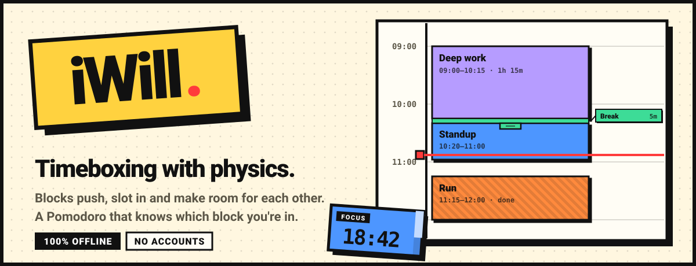
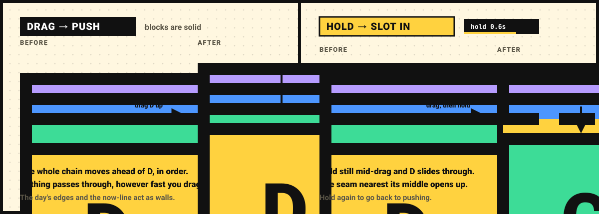
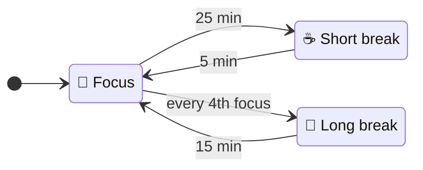
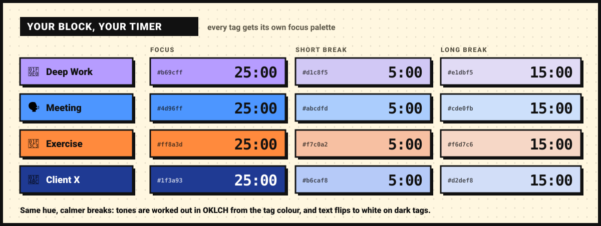
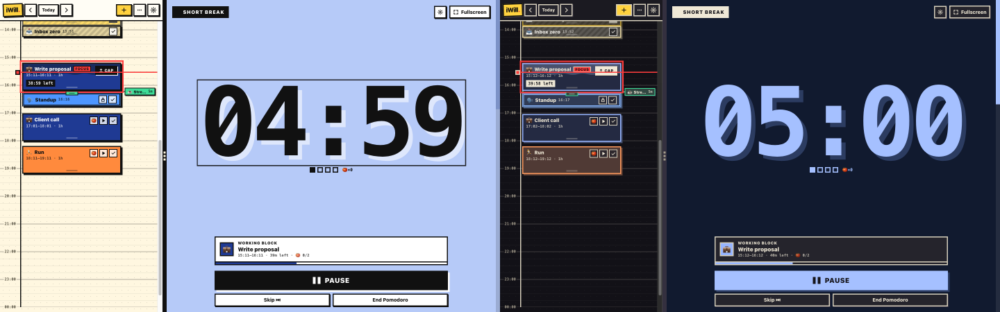
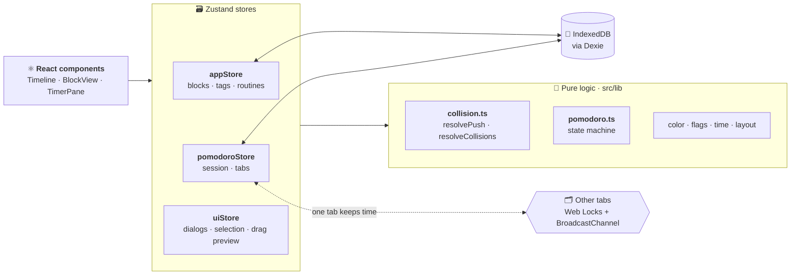

<p align="center">
  
</p>

<p align="center">
  
  
  
  
  
</p>

<h3 align="center">Plan your day in blocks that behave like real things.</h3>

<p align="center">
  Drag one and the rest of your day makes room. Finish early and the gap closes.<br>
  Focus with a Pomodoro that knows which block you're in.<br>
  <b>All in your browser. Nothing on a server.</b>
</p>

<br>

## ✨ What's inside

<table>
  <tr>
    <td width="50%" valign="top">
      <h3>🧱 Solid blocks</h3>
      Drag a block and everything in its way gets pushed, in order. Hold still mid-drag to slot it in between instead.
    </td>
    <td width="50%" valign="top">
      <h3>🍅 Focus that fits</h3>
      A Pomodoro sized to the block you're in, which keeps following it when you stretch, shrink or move the block.
    </td>
  </tr>
  <tr>
    <td valign="top">
      <h3>🤏 5-minute blocks</h3>
      Tiny blocks stay true to size as slivers, with a flag beside them and a pull tab to stretch them.
    </td>
    <td valign="top">
      <h3>🎨 Your colours</h3>
      Your own tags, emoji and colours, and the focus timer takes on the palette of the block you're in.
    </td>
  </tr>
  <tr>
    <td valign="top">
      <h3>☑️ Move in groups</h3>
      Select mode for touch screens: tap blocks to pick them, then drag them all at once.
    </td>
    <td valign="top">
      <h3>📴 Yours, offline</h3>
      No sign-up, no sync, no tracking. Your day lives in your browser's IndexedDB.
    </td>
  </tr>
</table>

## 🚀 Quick start

```bash
npm install
npm run dev        # → http://localhost:5173
```

> [!TIP]
> Open it in two tabs. Only one tab keeps time; the other can pause or end the session, or pull the timer over to itself.

<br>

## 🧱 Blocks are solid

<p align="center">
  
</p>

- **Drag = push.** Everything in the way moves ahead of the block you're dragging and keeps its order. Nothing passes through it, however fast you go.
- **Walls.** The start and end of the day, and the now-line on today, stop the chain, and your block stops with it.
- **Hold = slot in.** Hold still for about 0.6 s mid-drag: a bar fills on the time label, your phone ticks, and the block slides through, parting the blocks at the seam nearest its middle. Hold again to go back to pushing.
- **🔒 Locked and ✓ done blocks never move.** Pushed blocks hop over them, and you can't drop a block onto one.
- **Cap.** Finished early? Cap the block: it ends *now*, and the blocks after it move up by the freed time, as far as the first locked or done block.
- **All or nothing.** If any block would be pushed out of the day, nothing moves at all.

<details>
<summary><b>How the collision engine decides</b></summary>
<br>

Two pure, deterministic resolvers live in `src/lib/collision.ts`. Both take the saved blocks and return a list of moves, without changing anything:

| Resolver | Used for | Rule |
| --- | --- | --- |
| `resolvePush` | dragging, resizing, group moves | Keeps every block in its order. Blocks before the dragged one are pushed up, blocks after it pushed down. Day edges and the now-line are walls. |
| `resolveCollisions` | new blocks, editor changes, routines, extending, slot-in mode | Blocks starting above the drop go up, the rest down. In slot-in mode they split at the dragged block's centre; a dropped routine pushes everything down. |

The timeline runs the resolver on every pointer move to preview the cascade, then commits that preview when you let go.
</details>

<br>

## 🤏 Short blocks, big targets

- **As short as 5 minutes.** Drags, nudges and new blocks snap to the **time grid**: 5, 10 or 15 minutes, set in Settings, 5 by default. The editor accepts any time on a 5-minute mark, whatever the grid.
- **Slivers.** A block too thin to hold text (under 16 px, about 10 minutes at the default zoom) keeps its true height as a thin bar. Its title, length and time left move to a **flag** in a rail on the right, linked to it by a short line. Stacked slivers spread their flags apart, and you can drag a block by its flag.
- **Pull tabs.** Blocks of 10 minutes or less (or drawn under 22 px at the current zoom) get a little tab under their bottom edge to stretch them. It's much easier to hit than the edge itself. Slivers also get a larger invisible touch area.
- **The Now strip.** While a block is running, a bar pinned to the top of the timeline shows its title, time left and progress at a readable size. Tap it to jump to the block. It hides while the focus timer is already showing that block.

<br>

## 🍅 Focus mode

Start a focus from a block's 🍅 button, by double-tapping a block, with **Focus** in the header (a quick focus not tied to any block), or from the prompt that pops up when a block starts.



- **Fits the block.** Start a focus on a block that's already running and it's shortened to end with the block: 10 minutes left means a 10-minute focus, never longer than your usual focus length.
- **Follows the block.** Stretch, shrink or move the running block and the focus ends with it, up to its full length, previewed live while you drag. If the block stops being the current one, the focus gets its full length back. Breaks are never changed.
- **Wears the block's colours.** Focus is the tag colour, and breaks are calmer tones of the same hue:

<p align="center">
  
</p>

- **Never drifts.** The timer runs from wall-clock timestamps and is saved every second. A quick refresh carries straight on; after a longer absence it freezes at the last saved second and asks whether to resume.
- **One tab keeps time.** Other tabs can pause or end the session, or take the timer over, and if the timing tab closes another one picks it up.
- **About to run out?** The timer offers to extend the block (pushing the rest of the day down), cap it, or carry the session on into the next block.
- **☕ Breaks that run past their block.** A break inside a block is part of its budget and never touches the calendar. When one runs into the *next* block, the timer asks how to pay for those minutes:
  - **Push my day:** a Break block slots in and the rest of the day moves down. Locked blocks stay put.
  - **Take it from the next block:** it starts later and gets shorter.
  - **Leave my plan:** nothing moves, and the Now strip shows the minutes that went to your break.
  
  Tick *Remember my choice* to stop being asked (change it again in timer settings). Skip a break the day was pushed for and the unused minutes come back. A break block you already planned next (a *Stretch* with the Break tag, say) is used by the break instead of counted as lost.
- **The progress bar** on the timer's right edge shows how far through the block you are; for a quick focus, how far through the Pomodoro.

<details>
<summary><b>Split view and layout</b></summary>
<br>

- The timer docks **beside** the calendar on landscape screens at least 800 px wide, and **below** it otherwise.
- The calendar never gets narrower than **480 px** beside the timer (the width its header needs) or shorter than **300 px** above it, so its controls never squeeze together. For just the timer, go fullscreen.
- The split starts at 70% timer and 30% calendar. Drag the divider (or focus it and use the arrow keys) to resize, and double-click it to reset.
- <kbd>F</kbd> or the **Fullscreen** button hides the calendar, and <kbd>Esc</kbd> brings it back.
- On narrow screens the header tucks **Focus**, **Select** and **Routines** into a **⋯** menu.
- The focused block gets a red outline on the timeline, but you can still move, edit or delete it without affecting the timer.
</details>

<br>

## 🌙 Night Shift

<p align="center">
  
</p>

Dark mode isn't the light theme with the lights off. By day, tags are bright painted slabs. At night they become **light**: blocks turn into dark tinted panels with a glowing edge in their tag colour, and the running block fills up with its glow. The focus timer sinks into a deep tone of the block's hue, with the digits and the one primary button glowing in the tag colour. Hard shadows stay hard but become a quiet raised edge, and the yellow accents stay bright. Pick **Light**, **Dark** or **System** in Settings.

<br>

## 🏷️ Tags

Every block has one tag, which gives it its colour and emoji.

- Create, edit and delete tags right from the block editor (**＋ New tag**, **Manage tags →**) or from **Settings → Tags**.
- Pick an emoji from the grid or paste any you like, and a colour from the palette or the custom picker. Text on blocks switches between black and white to stay readable.
- Deleting a tag moves its blocks (on every day) and its routine steps to a tag you choose. The first tag is the default for new blocks.

## ☑️ Select mode

Tap **☑** in the header (or in the block editor) to pick several blocks. While selecting:

- A tap toggles a block, and dragging a selected block moves the whole selection, pushing (or, if you hold, slotting) just like a single block.
- The bar at the bottom can add every block touching the selection (**Connected**), nudge it up or down one grid step, lock it, mark it done, or delete it.
- <kbd>Esc</kbd>, **Done**, or switching days ends it.

<br>

## 🎮 Controls

| | 🖱️ Mouse | 👆 Touch | ⌨️ Keyboard |
| --- | --- | --- | --- |
| **Move a block** | drag it | long-press, then drag | focus it, <kbd>↑</kbd> <kbd>↓</kbd> |
| **Resize** | drag an edge or the pull tab | drag an edge or the pull tab | <kbd>Shift</kbd> + <kbd>↑</kbd> <kbd>↓</kbd> |
| **Slot in between** | hold still mid-drag | hold still mid-drag | |
| **New block** | click empty grid (30 min), or press and drag to size it | long-press empty grid, then drag | |
| **Edit** | click | tap | <kbd>Enter</kbd> |
| **Start a focus** | double-click, or 🍅 | double-tap, or 🍅 | |
| **Delete** | 🗑 in the editor | 🗑 in the editor | <kbd>Delete</kbd> or <kbd>Backspace</kbd> |
| **Timer** | | | <kbd>Space</kbd> start/pause · <kbd>F</kbd> fullscreen · <kbd>Esc</kbd> leave fullscreen |

Plain swipes on touch always scroll; that's why moving and drawing start with a long-press. Keyboard nudges move one grid step. Hover any icon button (or reach it with the keyboard) for a tooltip.

<br>

## 🧠 Under the hood



- **Pure core, thin stores.** Scheduling, timer and colour logic are pure functions in `src/lib/`, unit-tested in Node. The stores apply their results, and the UI previews them live before committing.
- **One transaction per gesture.** A drag that moves ten blocks writes them all at once, so nothing is ever half-saved.
- **Where things live.** Blocks, tags, routines, Pomodoro sessions and the focus log are kept in IndexedDB. Settings (zoom, day range, time grid, theme, notifications) are kept in `localStorage`.

<details>
<summary><b>File map</b></summary>
<br>

| Piece | Where |
| --- | --- |
| Collision engine (pure, deterministic) | `src/lib/collision.ts` |
| Pomodoro state machine (pure) | `src/lib/pomodoro.ts` |
| Colours: contrast, OKLCH, timer palettes | `src/lib/color.ts` |
| Sliver flag layout | `src/lib/flags.ts` |
| Time grid, snapping, formatting | `src/lib/time.ts` |
| Calendar/timer size limits | `src/lib/layout.ts` |
| Spring tuning | `src/lib/physics.ts` |
| Cross-tab ownership (Web Locks + BroadcastChannel) | `src/lib/tabSync.ts` |
| Store: Zustand + Dexie, one transaction per gesture | `src/store/appStore.ts` |
| Pomodoro store: persistence, recovery, tabs | `src/store/pomodoroStore.ts` |
| Timeline: gestures, push/slot, slivers, flags | `src/components/Timeline.tsx` |
| Block, liquid fill, Cap button | `src/components/BlockView.tsx` |
| Now strip | `src/components/NowStrip.tsx` |
| Select mode bar | `src/components/SelectionBar.tsx` |
| Routine deck (drag onto timeline) | `src/components/RoutineDeck.tsx` |
| Tags: manager, form, emoji and colour pickers | `src/components/tags/` |
| Timer pane, split divider, focus prompt | `src/components/focus/` |
| Tooltips | `src/components/Tooltip.tsx` |
| Block timer loop and notifications | `src/hooks/useActiveBlock.ts` |
</details>

<br>

## 🧪 Scripts

| Command | What it does |
| --- | --- |
| `npm run dev` | Start the dev server at http://localhost:5173 |
| `npm test` | Run the test suite once (Vitest) |
| `npm run test:watch` | Re-run tests as you edit |
| `npm run typecheck` | Type-check without building |
| `npm run build` | Type-check, then build to `dist/` |
| `npm run preview` | Serve the production build locally |

<br>

<p align="center">
  <sub>Built with React, Zustand, Dexie and Motion. Blocks are solid; your day is yours.</sub>
</p>
